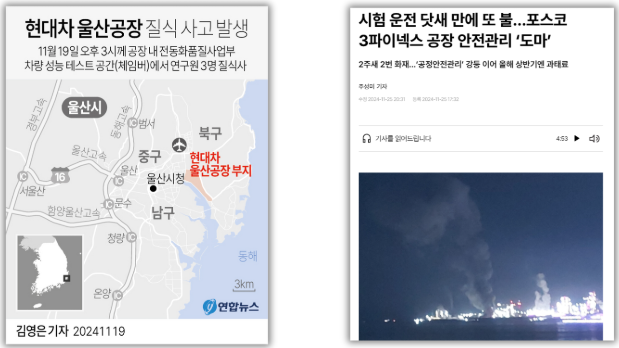
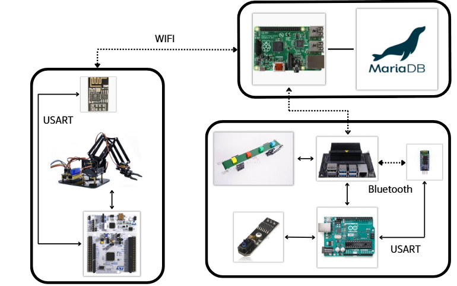
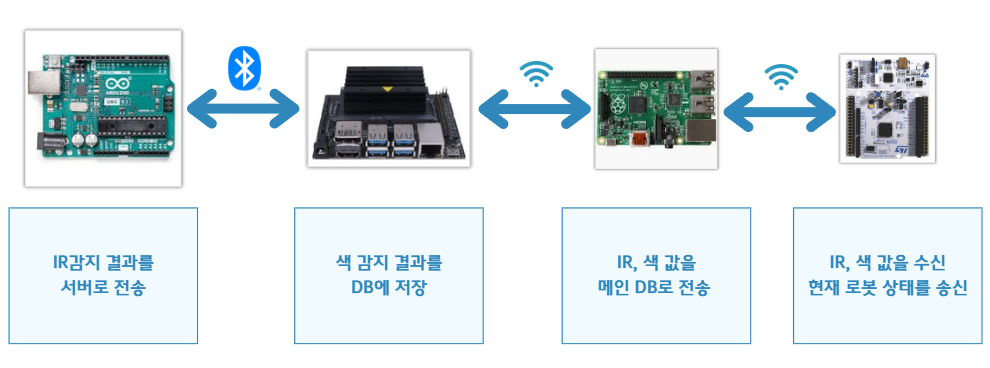
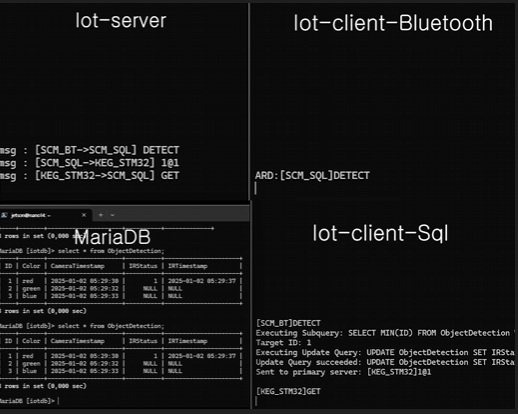
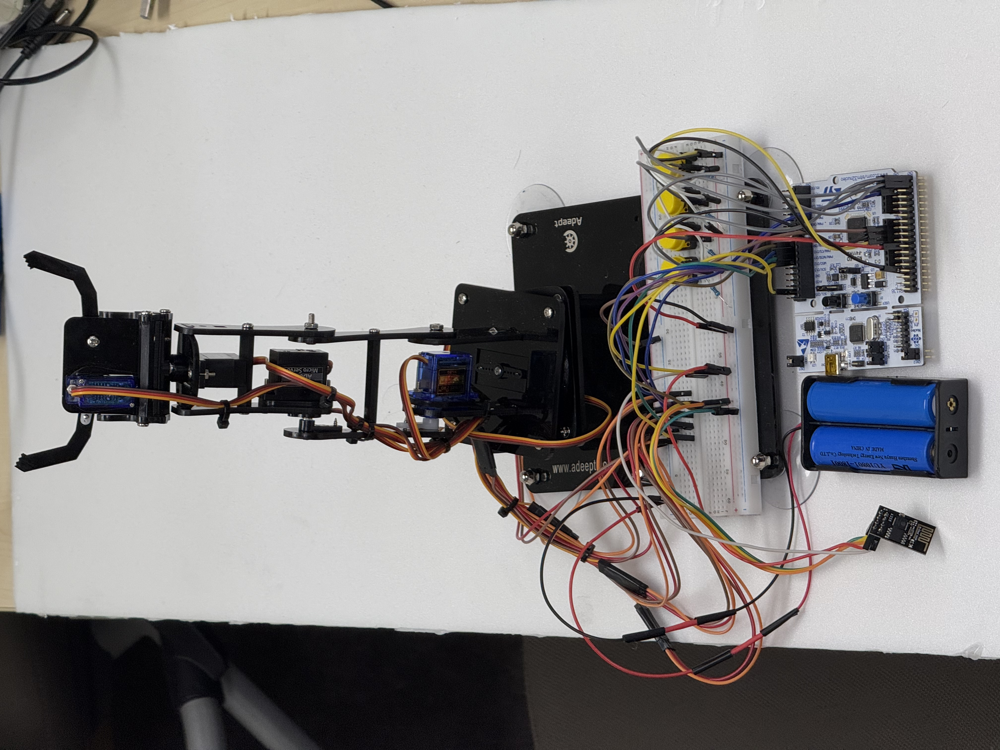

# SmartFactory 프로젝트

## 프로젝트 개요

### 프로젝트 주제
**스마트 팩토리 환경에서 로봇과 센서를 통합하여 실시간 객체 탐지, 색상 분류, 데이터 전송을 수행하는 시스템입니다. 효율적인 공정 관리 및 데이터 기반 자동화를 목표로 합니다.**

### 프로젝트 목표

- 공장 내 인명사고가 빈번히 발생
- 자동화를 통하여 인명사고를 예방

## 구성도

- **Jetson Nano**: 객체 탐지, 데이터 송수신.
- **Raspberry Pi**: 메인 서버 역할, 데이터 관리 및 송수신.
- **Arduino**: 센서 값 송신, 컨베이어 벨트 제어.
- **STM32**: 로봇 기구학 구현, 데이터 송수신.

---

## 기술 스택

- **STM32**: 로봇 팔 코드 구현.
- **Arduino**: 컨베이어 벨트 및 블루투스 코드 구현.
- **YOLO 모델**: 실시간 객체 탐지.
- **MariaDB**: 데이터 저장 및 관리.
- **Epoll 기반 비동기 I/O**: 다수의 연결을 효율적으로 처리.
- **POSIX 멀티스레드**: 병렬 작업 최적화.
- **메시지 큐**: 안정적인 데이터 처리 및 송신.

## 주요 기능

### 1. OpenCV와 YOLO 기반 객체 탐지
- OpenCV HSV 색상 분류 및 YOLO 모델 기반 객체 탐지를 결합하여 정확한 분류를 수행.
- 감지된 객체 정보를 MariaDB 데이터베이스에 저장.

### 2. Raspberry Pi와 Jetson Nano 활용
- **Jetson Nano**: 이미지 센싱 및 객체 탐지 작업.
- **Raspberry Pi**: 데이터 송수신 및 서버 역할을 수행.

### 3. Arduino와 STM32 통합 제어
- IR 센서를 사용하여 물체를 감지하면 컨베이어 벨트를 정지.
- STM32로 로봇 팔 제어 및 데이터 송수신.

### 4. 데이터 저장 및 송수신
- 모든 데이터는 MariaDB를 통해 저장 및 관리.
- 감지 결과를 메인 서버에 전달하고 로봇에게 명령 전송.

## 소스 코드

### [로봇 팔](Robot_arm)
### [컨베이어 벨트 & 카메라](conveyor)
### [컨트롤 서버](server)

## 발표 자료
### [바로 가기](Project_SmartFactory.pdf)

## 시연 영상

### [로봇팔 & 컨베이어벨트1](https://drive.google.com/file/d/1jCR7Uf6VYPLj5EQHHxeRxoe61p_12tU0/view?usp=sharing)

### [로봇팔 & 컨베이어벨트2](https://drive.google.com/file/d/1w4grHQpeCaMg4fAdjgQY6EStmskDzxIA/view?usp=sharing)

### [IoT 통신 흐름](https://drive.google.com/file/d/1krKenGNmB7tOQRbzUqb3nnTFdekrQnlu/view?usp=sharing)
