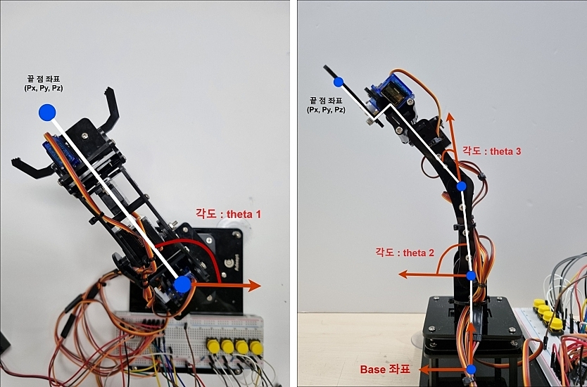
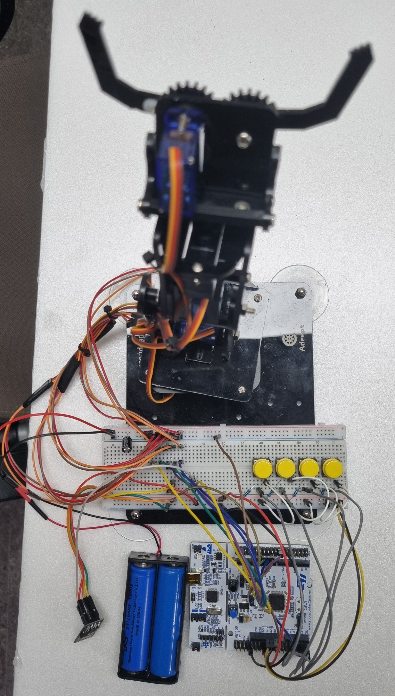

# 로봇팔 제어 & 내부 통신 클라이언트 코드

1. **STM Control**: 서버에서 전송된 색 데이터를 바탕으로 Gripping 위치 및 Drop위치를 결정
2. **Mathmatics**: 로봇팔의 End Effect의 좌표를 바탕으로 각 조인트의 각도를 계산하고 이를 PWM으로 바꿔주는 로직.
3. **Data Receive and Send**: 로봇팔이 가동중 혹은 가동이 완료 되었을 때 받아온 색상 데이터와 상태를 서버에 전달해줌.

---

## 구성 요소 및 동작 원리
### 주요기능
1. **기구학식을 통한 서보모터의 움직임 구현**
    - 로봇팔의 작용점(End Effect)의 좌표를 바탕으로 기구학식을 구현하여 서보모터의 움직임 계산.
    - STM32의 IOC 세팅을 퉁하여 TIM3, TIM4를 사용하여 PWM 구현
    - 급작스러운 동작을 막기 위하여 for문을 이용하여 부드러운 움직임 구현.
    
2. **esp8266을 사용하여 통신 Client**
    - 서버에서 송신된 색 데이터를 바탕으로 로봇을 구동.
    - 로봇이 구동하는 동안은 OBJECT_GRIPPING이라는 메세지를 송신.
    - 로봇의 구동이 완료되면 COLOR(RED, GREEN< BLUE)_ACT_DONE_ARM_READY라는 메세지 송신.
    - Button Interrupt를 통하여 메세지가 송신이 되지 않았을 경우 버튼을 통해 움직임을 구현.

---

## 기구학 구현


- 위의 그림과 같이 벡터를 사용하여 End Effect 좌표를 가지고 각 서보의 각도를 계산하는 수식 정의.

## 하드웨어 구성



- 부품 구성
    - STM32F411RE (STM32 Coretex-M4)
    - 18650 (3.7V 리튬이온 배터리) 2EA
    - 330uF 커패시터
    - esp8266 (WIFI 모듈)
    - Push Button 4EA
    - 4 DOF Robot Arm (Servo Motor : SG90 5EA)

- STM32 IOC 세팅
    - System Clock 84MHz로 설정
    - UART6: esp8266 연결을 위한 GPIO 설정 (Baudrate 115200)
    - TIM3, TIM4 사용 : 모터 PWM 구현을 위한 TIMER 설정
    - Global Interrupt를 위한 Button Interrupt 설정


## 코드를 통한 기구학식 및 움직임 구현

### 수식 코드
```C
theta1 = atan2(py, px) * 180 / M_PI;
long servo1_pwm = (theta1/180*2000) + 500;

R = sqrt(pow(px, 2) + pow(py, 2));
Q = sqrt(pow(R, 2) + pow(pz, 2));
P = sqrt(pow(R, 2) + pow((d1 - pz), 2));
K = sqrt(pow((a3 + d4), 2) + pow(a4, 2));

float gamma_y = pow(P, 2) + pow(d1, 2) - pow(Q, 2);
float gamma_x = 2 * P * d1;
gamma = acos(gamma_y / gamma_x) * 180 / M_PI;

float pi_y = pow(P, 2) + pow(a2, 2) - pow(K, 2);
float pi_x = 2 * P * a2;
pi = acos(pi_y / pi_x) * 180 / M_PI;

theta2 = 180 - (pi - (90 - gamma));
long servo2_pwm = theta2/180.0*2000.0 + 500;

float phi_y = pow(a2, 2) + pow(K, 2) - pow(P, 2);
float phi_x = 2 * a2 * K;
phi = acos(phi_y / phi_x) * 180 / M_PI;
beta = atan2(a4, a3 + d4) * 180 / M_PI;

theta3 = 180 - (phi + beta);
long servo3_pwm = 2500 - theta3/180.0*2000.0;

(*servo_data).servo1_pwm = servo1_pwm;
(*servo_data).servo2_pwm = servo2_pwm;
(*servo_data).servo3_pwm = servo3_pwm;
```
- **참고 논문**
    - **The modeling of Inverse Kinematics for 5 DOF manipulator, V.N Iliukin, 2017, Procedia Engineering**
    - **Inverse Kinematics Analysis and Simulation of a 5 DOF Robotic Arm, Tahseen F. Abaas, 2019, Al-Khwarizmi Engineering Journal**

### 수식에서 나온 각도를 바탕으로 움직임을 구현한 코드
```C
if(m_servo1_pwm >= servo1_init_pwm)
{
    for(servo1_current_pwm = servo1_init_pwm; servo1_current_pwm < m_servo1_pwm; servo1_current_pwm+=MOTOR_MOVE)
    {
        __HAL_TIM_SET_COMPARE(&htim3, TIM_CHANNEL_1, servo1_current_pwm);
        HAL_Delay(MOTOR_DELAY);
    }

}
else if(m_servo1_pwm < servo1_init_pwm)
{
    for(servo1_current_pwm = servo1_init_pwm; servo1_current_pwm > m_servo1_pwm; servo1_current_pwm-=MOTOR_MOVE)
    {
        __HAL_TIM_SET_COMPARE(&htim3, TIM_CHANNEL_1, servo1_current_pwm);
        HAL_Delay(MOTOR_DELAY);
    }

}

...
```
- 움직임과 간섭을 최소화 하기 위해서 모터의 움직임 순서를 결정
- 움직임 순서 : 감지된 물체 잡기 -> 안전지대로 복귀 -> 물체를 요구되는 자리에 넣기 -> 안전지대로 복귀
- 급작스러운 움직임을 막기 위하여 for문을 사용하여 움직임 구현

### 서버에 접속하기 위한 Client
```C
#define SSID "내부망 ID"
#define PASS "내부망 PW"
#define LOGID "서버에 등록된 ID"
#define PASSWD "서버에 등록된 PW"
#define DST_IP "서버 IP"
#define DST_PORT PORT Number
```

### 데이터를 송수신 받기 위한 코드
```C
if(strstr((char *)cb_data.buf,"+IPD") && cb_data.buf[cb_data.length-1] == '\n')
{
    strcpy(strBuff,strchr((char *)cb_data.buf,'['));
    memset(cb_data.buf,0x0,sizeof(cb_data.buf));
    cb_data.length = 0;
    esp_event(strBuff);
}
```
- 조건식을 통하여 ESP8266에서만 받은 내용을 실행할 수 있게 작성
- 다음 데이터를 받기 위해서 버퍼 초기화

```C
void esp_event(char * recvBuf)

....

pToken = strtok(recvBuf,"[@]");
while(pToken != NULL)
{
pArray[i] = pToken;
if(++i >= ARR_CNT)
    break;
pToken = strtok(NULL,"[@]");
}
```
- 받은 내용을 [@]로 분할하여 배열에 저장

```C
else if(!strcmp(pArray[1],"1"))
{
    sprintf(sendBuf, "[%s]OBJECT_GRIPPING\n",pArray[0]);
    esp_send_data(sendBuf);
    grip_flag = 1;
    mathmatics(grip_pos, &servo_data);
    printf("servo1_pwm : %ld, servo2_pwm : %ld, servo3_pwm : %ld\r\n", servo_data.servo1_pwm, servo_data.servo2_pwm, servo_data.servo3_pwm);
    move_direction(&servo_data);
    grip_flag = 0;

    if(!strcmp(pArray[2], "1"))
    {
        mathmatics(red_pos, &servo_data);
        printf("servo1_pwm : %ld, servo2_pwm : %ld, servo3_pwm : %ld\r\n", servo_data.servo1_pwm, servo_data.servo2_pwm, servo_data.servo3_pwm);
        move_direction(&servo_data);
        sprintf(sendBuf, "[%s]RED_ACT_DONE_ARM_READY\n",pArray[0]);
        esp_send_data(sendBuf);
    }

....
```
- 수신받은 처리된 데이터를 조건식으로 구성
- 로봇의 상태와 결과를 나타내는 Buffer를 생성하고 이를 서버에 전송