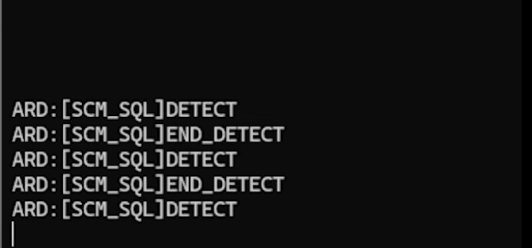

# 컨베이어 벨트 & 내부통신코드

1. **Color Detector**: 카메라를 이용해 물체 색상을 감지하고 데이터베이스(MariaDB)에 저장.
2. **IR Detection & Bluetooth Communication**: IR 센서 상태와 감지된 색상을 블루투스로 전송.
3. **Server & Database Integration**: 서버에서 데이터베이스를 관리하며, 추가로 STM32 로봇 팔에 작업 명령을 전달.
4. **STM32 Control**: 로봇 팔이 색상 및 상태 데이터를 기반으로 물체를 집어 이동.


---

### 주요 구성 요소 및 동작 원리

#### 1. **Color Detection** (`color-detector.py`)
## 주요 기능
1. **YOLO 모델 기반 객체 탐지**
   - Yolo11n 기반 Fine-Tuning 모델(`color.pt`)을 로드하여 세 개의 병뚜껑을 감지
   - 클래스 ID와 Confidence를 필터링

2. **실시간 웹캠 스트림 분석**
   - 중앙에 고정된 바운딩 박스를 설정하여 감지 영역 제한한
   - 실시간으로 탐지된 객체를 화면에 표시

3. **MariaDB 연동**
   - 탐지된 객체 정보를 MariaDB 데이터베이스에 저장
   - 데이터베이스 테이블 `ObjectDetection`에 색상 정보와 타임스탬프를 저장

- **데이터베이스 저장 형식**:
  - 컬럼: `Color`, `CameraTimestamp`
  - 예: `Red, 2025-01-01 10:20:30`

## 코드 구성

### 1. YOLO 모델 초기화
```python
from ultralytics import YOLO
model = YOLO("color.pt")
```
- `color.pt`: YOLO 모델 파일.

### 2. MariaDB 연결
```python
conn = pymysql.connect(
    host='localhost',
    port=3306,
    user='iot',
    password='pwiot',
    database='iotdb'
)
cursor = conn.cursor()
```
- 데이터베이스 연결을 설정하고 쿼리를 실행하기 위한 Cursor 객체를 생성

### 3. 객체 탐지
- 객체 탐지는 0.5초 간격으로 진행
- 마지막 감지 시간과 현재 감지 시간의 차를 이용하여 무분별한 탐지, DB저장 방지
```python
if current_time - last_detection_time > 0.5:
        results = model.predict(
            roi,
            verbose=False,
            imgsz=(640, 480),  # 고정된 이미지 크기
            device="cuda"  # CUDA 사용
        )
```

### 4. 객체 탐지 및 데이터베이스 저장
- 객체 탐지 로직은 ROI(Region of Interest)를 기준으로 YOLO 모델 추론을 수행
- 클래스 ID와 Confidence 조건을 만족하는 객체만 탐지 결과로 처리

```python
if class_id in TARGET_CLASSES and confidence >= CONFIDENCE_THRESHOLD:
    detected_class = model.names[class_id]
    insert_to_db(detected_class)
```

### 5. 데이터베이스 저장 함수
```python
def insert_to_db(color):
    timestamp = datetime.now()
    query = "INSERT INTO ObjectDetection (Color, CameraTimestamp) VALUES (%s, %s)"
    cursor.execute(query, (color, timestamp))
    conn.commit()
```
- 탐지된 객체의 색상 및 타임스탬프를 데이터베이스 테이블에 저장


## 주요 변수
- **`TARGET_CLASSES`**: 객체의 클래스 ID 리스트 ([0, 1, 2]).
- **`CONFIDENCE_THRESHOLD`**: 최소 Confidence 값 (기본값: 0.5).
- **`BOX_WIDTH`, `BOX_HEIGHT`**: 관심 영역의 크기 (200x200).

### 바운딩 박스를 지정하여 바운딩 박스에 들어온 물체를 감지

---

#### 2. **Bluetooth Communication** (`iot_client_bluetooth.c`)
- **역할**: IR 센서 데이터를 블루투스로 서버에 전송.
- **세부 동작**:
  - IR 감지 시 메시지를 `[SCM_SQL]DETECT` 형식으로 블루투스를 통해 전송.
  - IR 상태가 변경되면 `[SCM_SQL]END_DETECT` 메시지를 전송.
  - 블루투스 연결 상태를 지속적으로 확인하며 서버와 소통.

```c
if (strstr(msg, "DETECT") != NULL) {
    write(dev_fd->btfd, "[SCM_SQL]DETECT\n", strlen("[SCM_SQL]DETECT\n"));
}
```
### 클라이언트를 통해 전송되는 메시지


---

#### 3. **Server & SQL Management** (`iot_client_sql.c`, `iot_server.c`)
- **역할**: 데이터베이스 관리 및 STM32로 명령 전송.
- **SQL 관리**:
  - `ObjectDetection` 테이블에서 IR 상태(`IRStatus`)가 1인 데이터를 조회.
  - 감지된 색상 데이터를 기반으로 `[KEG_STM32]1@<color_code>` 형식의 명령 전송.
  - 작업 완료 메시지(`DONE`) 수신 후 새로운 데이터를 처리.

```c
snprintf(name_msg, sizeof(name_msg), "[KEG_STM32]%d@%d\n", current_status, col);
write(primary_sock, name_msg, strlen(name_msg));
```
- **서버 동작**:
  - 클라이언트 연결 관리 (최대 32개 클라이언트).
  - 메시지 수신 후 각 클라이언트에 전달.

### SQL 클라이언트가 BT에게 수신됨과 동시에 STM에게 송신


### 내부 통신 서버, 모든 메시지가 거쳐간다.

#### 4. **STM32 Control** (`conveyor.ino`)
- **역할**: 색상 및 IR 상태 데이터를 기반으로 로봇 팔 제어.
- **세부 동작**:
  - `[KEG_STM32]<status>@<color_code>` 형식으로 데이터 수신.
  - 색상별로 동작을 구분하며 물체를 집어 지정된 위치로 이동.
  - 작업 완료 시 `[SCM_SQL]DONE` 메시지 송신.

### IR 감지결과 메시지를 실시간으로 송신

---

### 데이터 흐름

1. **Color Detection**: 색상 감지 후 MariaDB에 데이터 저장.
2. **IR Detection & Bluetooth**: IR 감지 시 데이터베이스 업데이트 및 블루투스 전송.
3. **Server**: 블루투스 메시지를 수신 후 STM32에 전달.
4. **STM32**: 로봇 팔이 동작하고 완료 시 메시지를 다시 서버로 전송.

---

### 실행 방법

1. **Color Detector**:
   ```bash
   python3 color-detector.py
   ```

2. **Bluetooth Client**:
   ```bash
   ./iot_client_bluetooth <Server_IP> <Port> <Device_Name>
   ```

3. **SQL Client**:
   ```bash
   ./iot_client_sql <Server_IP> <Port> <Device_Name>
   ```

4. **Server**:
   ```bash
   ./iot_server <Port>
   ```

5. **STM32**:
   - `conveyor.ino` 코드를 Arduino IDE를 통해 업로드.


### 주요 테이블 스키마

```sql
CREATE TABLE ObjectDetection (
    ID INT AUTO_INCREMENT PRIMARY KEY,
    Color VARCHAR(10),
    CameraTimestamp DATETIME,
    IRStatus TINYINT(1),
    IRTimestamp DATETIME
);
```


### 오류 처리

1. **Camera Error**:
   - 카메라가 감지되지 않을 경우 OpenCV에서 에러 메시지 출력.
   - 해결: 카메라 연결 상태 확인 후 재실행.

2. **Bluetooth Connection Error**:
   - 블루투스 소켓 생성 실패 시 에러 메시지 출력.
   - 해결: 블루투스 장치 및 설정 확인.

3. **Database Error**:
   - SQL 쿼리 실패 시 상세 에러 메시지 출력.
   - 해결: MariaDB 연결 및 테이블 상태 확인.